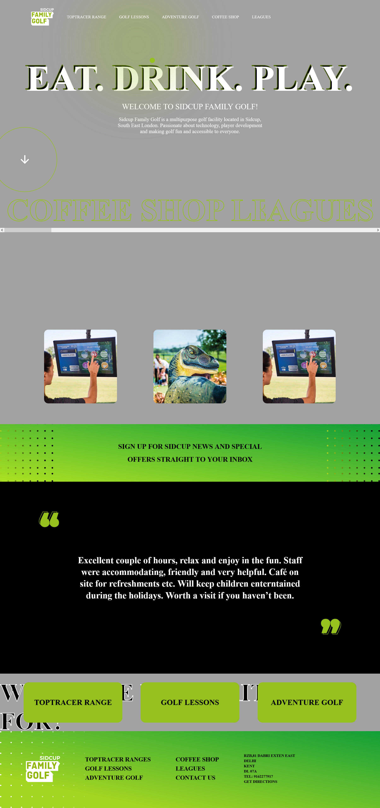

# ⛳ Sidcup Golf Family — Interactive Landing Page

<p align="center">
  A modern, immersive, and responsive golf-themed landing page inspired by the visual style of Sidcup Family Golf.
</p>

<p align="center">
  <a href="https://surajkumar9113.github.io/sidcup-golf-family/">
    
  </a>

  

  

  
</p>

---

## 📌 About The Project

**Sidcup Golf Family — Interactive Landing Page** is a frontend project inspired by the visual experience of Sidcup Family Golf.

The project focuses on creating an engaging and modern website using **bold typography, immersive sections, smooth animations, interactive elements, and responsive layouts**.

It was built as a frontend practice project to improve my understanding of **modern UI development, CSS animations, responsive design, and JavaScript interactions**.

---

## ✨ Features

- ⛳ Modern golf-themed landing page
- 🎨 Bold and engaging visual design
- 🔴 Vibrant accent color system
- ✨ Smooth animations and transitions
- 🖱️ Interactive UI elements
- 📱 Fully responsive layout
- 🧩 Structured content sections
- 🎯 Modern typography and visual hierarchy
- ⚡ Optimized frontend experience

---

## 🛠️ Built With

| Technology | Purpose |
|------------|---------|
| **HTML5** | Semantic page structure |
| **CSS3** | Styling, layouts & animations |
| **JavaScript** | Interactive functionality |
| **Flexbox / Grid** | Responsive layouts |
| **Git & GitHub** | Version control & deployment |

---

## 🎨 Design Highlights

- 🟢 Immersive hero section
- 🔴 Bold accent colors
- 🎬 Smooth scroll interactions
- 🖼️ Image-focused sections
- ✨ Hover effects and transitions
- 📱 Mobile-friendly responsive design
- 🎯 Clean visual hierarchy
- 💻 Modern frontend layout techniques

---

## 🖥️ Preview

<p align="center">
  
</p>

---

## 🎯 Project Goals

This project was created to practice:

- Modern landing page development
- Responsive web design
- CSS animations and transitions
- Interactive frontend elements
- Typography and spacing
- Advanced layout techniques
- Creating visually engaging user interfaces

---

## 🚀 Live Project

<p align="center">
  <a href="https://surajkumar9113.github.io/sidcup-golf-family/">
    
  </a>
</p>

---

## 📂 Project Structure

```text
Sidcup-Golf-Family/
│
├── index.html
├── style.css
├── script.js
├── images/
│   └── ...
└── README.md
